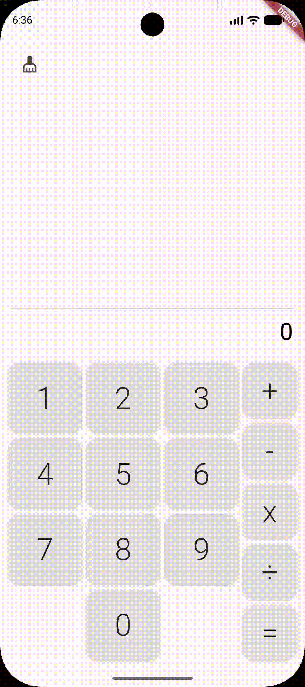

# Command Pattern

## Introducción

El patrón de diseño Command brinda una solución estructurada para encapsular solicitudes o acciones como objetos independientes, lo que permite desacoplar al invocador de la lógica de ejecución. Esta desacoplamiento facilita la extensibilidad, el mantenimiento y la pruebas unitarias, al margen de habilitar funcionalidades como deshacer/rehacer o colas de operaciones. Al basarse en abstracciones comunes (interfaces o clases base), el patrón se adapta a una amplia variedad de dominios y arquitecturas sin depender de tecnologías específicas.

## Conceptos clave

### Command  

Interfaz que encapsula una solicitud/acción como un objeto, permitiendo desacoplador el emisor del receptor. Facilita la reutilización, la gestión de transacciones y la extensión del sistema sin modificar código existente.

### Concrete Command

Una implementación específica del interfaz de comando. Realiza una acción concreta y puede interactuar directamente con el receptor para ejecutar la tarea asignada.

### Invoker

Objeto que invoca el comando cuando se requiere ejecutar una acción. No conoce los detalles del receptor, solo la interfaz del comando, lo que permite separar la solicitud de su ejecución.

### Receiver

Objeto que contiene la lógica necesaria para ejecutar la acción. El comando le envía un mensaje al receptor, que realiza la operación, sin que el emisor o el cliente conozcan los detalles de dicha ejecución.

### Client

Entidad que solicita una acción (ej: un botón en una interfaz). El cliente genera el comando concreto e interactúa con el emisor para delegar la ejecución de la tarea.

## Ejemplificando la aplicación Command Pattern en Flutter

Vamos a construir una calculadora de operaciones básicas (suma, resta, multiplicación y división) que opere sobre números enteros, implementando cada operación como un **Command** independiente. Esta sección describe la implementación completa y real del proyecto, desde la estructura de carpetas hasta el flujo de ejecución, con una narrativa coherente que integra teoría y código.

---

### 1. Estructura del Proyecto

La implementación sigue una arquitectura por capas clara, separando el núcleo del patrón (core), la lógica de dominio (domain) y la presentación (ui):

```plain
lib/
├── core/
│   ├── command.dart              # Interfaz base Command
│   ├── invoker.dart              # Interfaz base Invoker
│   ├── receiver.dart             # Interfaz base Receiver
│   └── types/
│       ├── number_button_enum.dart   # Botones numéricos (0-9)
│       └── option_button_enum.dart   # Botones de operación (+, -, ×, ÷, =)
├── domain/
│   ├── calculator_invoker.dart       # Invoker concreto con historial y undo
│   ├── calculator_receiver.dart      # Receiver concreto con lógica aritmética
│   └── commands/
│       ├── addition_command.dart     # Command: suma
│       ├── divide_command.dart       # Command: división
│       ├── multiply_command.dart     # Command: multiplicación
│       └── subtract_command.dart     # Command: resta
├── main.dart                         # Punto de entrada
└── ui/
    ├── calculator_page.dart          # Cliente: orquesta UI + comandos
    └── widgets/
        ├── calculator_command_button.dart  # Botón de operación
        ├── calculator_number_button.dart   # Botón numérico
        ├── calculator_screen_widget.dart   # Pantalla: historial + resultado
        └── calculator_widget.dart          # Teclado completo (grid + columna)
```

> **Diagrama de interacción:** Las clases se relacionan según el patrón clásico: el **Cliente** (`CalculatorPage`) crea **Comandos Concretos** pasándoles el **Receiver** (`CalculatorReceiver`), y los envía al **Invoker** (`CalculatorInvoker`) para su ejecución. El Invoker mantiene historial.


---

### 2. Núcleo del Patrón: Abstracciones Base (`lib/core/`)

Estas interfaces definen el contrato que permite el desacoplamiento total entre quien solicita una operación y quien la ejecuta.

#### 2.1 Command — `lib/core/command.dart`

```dart
abstract class Command {
  final Receiver receiver;

  Command(this.receiver);
  void execute();
  void undo();
}
```

**Contrato:** Todo comando conoce a su `Receiver` y expone `execute()` (hacer) y `undo()` (deshacer).

#### 2.2 Invoker — `lib/core/invoker.dart`

```dart
abstract class Invoker {
  final Receiver receiver;
  Invoker(this.receiver);
  void execute(Command command);
  void undo();
}
```

**Contrato:** El invoker ejecuta comandos y opcionalmente los guarda para permitir deshacer.

#### 2.3 Receiver — `lib/core/receiver.dart`

```dart
abstract class Receiver {
  void add(int value);
  void subtract(int value);
  void multiply(int value);
  void divide(int value);

  int get result => 0;
}
```

**Contrato:** Operaciones aritméticas primitivas. El receiver **no conoce** el patrón Command; solo expone comportamiento de dominio.

#### 2.4 Tipos de Datos (Enums) — `lib/core/types/`

```dart
// number_button_enum.dart
enum NumberButtonEnum {
  one(1), two(2), three(3), four(4), five(5),
  six(6), seven(7), eight(8), nine(9), zero(0);

  final int value;
  const NumberButtonEnum(this.value);
}
```

```dart
// option_button_enum.dart
enum OptionButtonEnum {
  addition('+'), subtraction('-'), multiplication('x'),
  division('÷'), equals('=');

  final String label;
  const OptionButtonEnum(this.label);
}
```

> **Diseño:** Enums con valores asociados (`value`, `label`) dan type-safety y evitan `switch` sobre strings en toda la app.

---

### 3. Implementaciones Concretas del Dominio (`lib/domain/`)

#### 3.1 Receiver Concreto: `CalculatorReceiver` — `lib/domain/calculator_receiver.dart`

```dart
class CalculatorReceiver extends Receiver {
  int _result = 0;

  @override
  void add(int value) => _result += value;
  @override
  void subtract(int value) => _result -= value;
  @override
  void multiply(int value) => _result *= value;
  @override
  void divide(int value) => _result ~/= value;  // División entera

  @override
  int get result => _result;
}
```

**Responsabilidad:** Contiene la lógica de negocio pura (aritmética) y mantiene el estado (`_result`). Es completamente ajeno al patrón Command.

#### 3.2 Invoker Concreto: `CalculatorInvoker` — `lib/domain/calculator_invoker.dart`

```dart
class CalculatorInvoker extends Invoker {
  CalculatorInvoker(super.receiver);

  final List<Command> _history = [];
  List<Command> get history => _history;

  @override
  void execute(Command command) {
    command.execute();
    _history.add(command);  // Guarda para posible undo
  }

  @override
  void undo() {
    if (_history.isNotEmpty) {
      final lastCommand = _history.removeLast();
      lastCommand.undo();   // Ejecuta operación inversa
    }
  }
}
```

**Responsabilidades:**
- Ejecutar comandos y mantener historial lineal
- Proveer `undo()` para deshacer la última operación
- No conoce comandos concretos ni detalles del receiver

#### 3.3 Comandos Concretos — `lib/domain/commands/`

Cada comando encapsula **una operación** y **su inversa** (para `undo`):

```dart
// addition_command.dart
class AdditionCommand extends Command {
  AdditionCommand(super.receiver, this._value);
  final int _value;

  @override
  void execute() => receiver.add(_value);
  
  @override
  void undo() => receiver.subtract(_value);  // Inversa: restar
}
```

```dart
// subtract_command.dart
class SubtractCommand extends Command {
  SubtractCommand(super.receiver, this._value);
  final int _value;

  @override
  void execute() => receiver.subtract(_value);
  
  @override
  void undo() => receiver.add(_value);  // Inversa: sumar
}
```

```dart
// multiply_command.dart
class MultiplyCommand extends Command {
  MultiplyCommand(super.receiver, this._value);
  final int _value;

  @override
  void execute() => receiver.multiply(_value);
  
  @override
  void undo() => receiver.divide(_value);  // Inversa: dividir
}
```

```dart
// divide_command.dart
class DivideCommand extends Command {
  DivideCommand(super.receiver, this._value);
  final int _value;

  @override
  void execute() => receiver.divide(_value);
  
  @override
  void undo() => receiver.multiply(_value);  // Inversa: multiplicar
}
```

> **Clave del patrón:** Cada comando concreto conoce al `Receiver` y al operando (`_value`). Al ejecutar `execute()`, delega al receiver; al ejecutar `undo()`, aplica la operación matemática inversa. Esto permite al `Invoker` deshacer operaciones **sin conocer su naturaleza**.

---

### 4. Capa de Presentación — UI (`lib/ui/`)

La UI está compuesta por widgets reutilizables y una página principal que actúa como **Cliente** del patrón Command.

#### 4.1 Widgets de Botones — `lib/ui/widgets/`

**Botón Numérico** (`calculator_number_button.dart`):
```dart
class CalculatorNumberButton extends StatelessWidget {
  final double width, height;
  final NumberButtonEnum number;
  final void Function(NumberButtonEnum) onTap;
  // ... build: Material + InkWell + Center(Text(number.value))
}
```

**Botón de Operación** (`calculator_command_button.dart`):
```dart
class CalculatorCommandButton extends StatelessWidget {
  final double width, height;
  final OptionButtonEnum option;
  final void Function(OptionButtonEnum) onTap;
  // ... build: similar, muestra option.label (+, -, ×, ÷, =)
}
```

#### 4.2 Pantalla de Resultados — `calculator_screen_widget.dart`

```dart
class CalculatorScreenWidget extends StatelessWidget {
  final int result;
  final List<(OptionButtonEnum?, NumberButtonEnum?)> history;
  final VoidCallback onClear;

  @override
  Widget build(BuildContext context) => Column(
    mainAxisAlignment: MainAxisAlignment.end,
    crossAxisAlignment: CrossAxisAlignment.end,
    children: [
      Row(children: [IconButton(onPressed: onClear, icon: Icon(Icons.cleaning_services))]),
      const Spacer(),
      Row(
        mainAxisAlignment: MainAxisAlignment.end,
        crossAxisAlignment: CrossAxisAlignment.end,
        children: history.map((tuple) {
          final (option, number) = tuple;
          return Row(
            children: [
              if (option != null) Text('${option.label} ', style: TextStyle(fontSize: 32)),
              if (number != null) Text('${number.value} ', style: TextStyle(fontSize: 32)),
            ],
          );
        }).toList(),
      ),
      const Divider(),
      Text(result.toString(), style: TextStyle(fontSize: 32)),
    ],
  );
}
```

Muestra el historial como secuencia de "operación número" (ej: `+ 1 × 2`) y el resultado final abajo.

#### 4.3 Teclado Completo — `calculator_widget.dart`

```dart
class CalculatorWidget extends StatelessWidget {
  final void Function(NumberButtonEnum) onNumberTap;
  final void Function(OptionButtonEnum) onOptionTap;

  @override
  Widget build(BuildContext context) {
    final numbers = NumberButtonEnum.values;
    final options = OptionButtonEnum.values;

    return LayoutBuilder(builder: (context, constraints) => Row(
      crossAxisAlignment: CrossAxisAlignment.end,
      children: [
        // Grid 3x4 de números (80% ancho)
        SizedBox(width: constraints.maxWidth * 0.8, child: Wrap(
          alignment: WrapAlignment.center,
          children: numbers.map((n) => CalculatorNumberButton(
            number: n,
            width: constraints.maxWidth * 0.8 / 3,
            height: constraints.maxHeight / 4,
            onTap: onNumberTap,
          )).toList(),
        )),
        // Columna de operaciones (20% ancho)
        SizedBox(width: constraints.maxWidth * 0.2, child: Column(
          mainAxisAlignment: MainAxisAlignment.end,
          children: options.map((o) => CalculatorCommandButton(
            option: o,
            width: constraints.maxWidth * 0.2,
            height: constraints.maxHeight / options.length,
            onTap: onOptionTap,
          )).toList(),
        )),
      ],
    ));
  }
}
```

Responsive: usa `LayoutBuilder` para adaptarse a cualquier tamaño de pantalla.

---

### 5. Cliente Principal: `CalculatorPage` — `lib/ui/calculator_page.dart`

El `CalculatorPage` es el **Cliente** del patrón Command: orquesta la UI, gestiona el estado de entrada del usuario y coordina la ejecución de comandos a través del `Invoker`.

```dart
class CalculatorPage extends StatefulWidget {
  const CalculatorPage({super.key});
  @override State<CalculatorPage> createState() => _CalculatorPageState();
}

class _CalculatorPageState extends State<CalculatorPage> {
  late final CalculatorReceiver _calculatorReceiver;
  late final CalculatorInvoker _calculatorInvoker;

  // Historial de tuplas: (operación_pendiente?, número_ingresado?)
  final List<(OptionButtonEnum?, NumberButtonEnum?)> _history = [];
  int _currentIndex = 0;

  // Máquina de estados simple: valida secuencia número → operación → número
  bool? _lastWasNumber;
  bool? _lastWasOption;

  @override
  void initState() {
    super.initState();
    _calculatorReceiver = CalculatorReceiver();
    _calculatorInvoker = CalculatorInvoker(_calculatorReceiver);
  }

  @override
  Widget build(BuildContext context) => Scaffold(
    body: SafeArea(child: Center(child: LayoutBuilder(builder: (context, constraints) => Column(
      children: [
        // Pantalla superior (50% alto)
        Container(
          padding: EdgeInsets.symmetric(vertical: 8, horizontal: 16),
          height: constraints.maxHeight * 0.5,
          child: CalculatorScreenWidget(
            result: _calculatorReceiver.result,
            history: _history,
            onClear: _resetAll,
          ),
        ),
        // Teclado inferior (50% alto)
        Container(
          padding: EdgeInsets.all(8),
          height: constraints.maxHeight * 0.5,
          child: CalculatorWidget(
            onNumberTap: _onNumberTap,
            onOptionTap: _onOptionTap,
          ),
        ),
      ],
    ))))),
  );

  // ── Entrada numérica ──

  void _onNumberTap(NumberButtonEnum number) {
    // Permite número si: inicio O última acción fue operación
    if (_lastWasOption == null || _lastWasOption == true) {
      if (_history.isEmpty) {
        _history.add((null, number));
        _calculatorInvoker.execute(MultiplyCommand(_calculatorReceiver, 0)); // Inicializa en 0
      } else {
        _history[_currentIndex] = (_history[_currentIndex].$1, number);
      }
      _currentIndex++;
      _lastWasNumber = true;
      _lastWasOption = false;
      setState(() {});
    }
  }

  // ── Entrada de operación ──

  void _onOptionTap(OptionButtonEnum option) {
    // Permite operación solo si último fue número
    if (_lastWasNumber == true) {
      _history.add((option, null));
      _lastWasNumber = false;
      _lastWasOption = true;

      if (option == OptionButtonEnum.equals) {
        _calculateTotal();
      }
      setState(() {});
    }
  }

  // ── Ejecución del historial ──

  void _calculateTotal() {
    for (final (option, number) in _history) {
      if (number != null) {
        switch (option) {
          case OptionButtonEnum.addition:
            _calculatorInvoker.execute(AdditionCommand(_calculatorReceiver, number.value));
            break;
          case OptionButtonEnum.subtraction:
            _calculatorInvoker.execute(SubtractCommand(_calculatorReceiver, number.value));
            break;
          case OptionButtonEnum.multiplication:
            _calculatorInvoker.execute(MultiplyCommand(_calculatorReceiver, number.value));
            break;
          case OptionButtonEnum.division:
            _calculatorInvoker.execute(DivideCommand(_calculatorReceiver, number.value));
            break;
          case OptionButtonEnum.equals:
            break; // Solo disparador
        }
      }
    }
    _resetHistory();
  }

  void _resetHistory() {
    _history.clear();
    _currentIndex = 0;
  }

  void _resetAll() {
    _resetHistory();
    _calculatorInvoker.execute(MultiplyCommand(_calculatorReceiver, 0));
    _lastWasNumber = null;
    _lastWasOption = null;
    setState(() {});
  }
}
```

**Flujo de estado en `_CalculatorPageState`:**
- `_history`: Acumula pares `(operación, número)` según el usuario teclea
- `_lastWasNumber` / `_lastWasOption`: Evitan secuencias inválidas (`++`, `=5`, etc.)
- Al presionar `=`, `_calculateTotal()` recorre `_history` y ejecuta cada comando vía `Invoker`

---

### 6. Punto de Entrada — `lib/main.dart`

```dart
void main() {
  runApp(const MainApp());
}

class MainApp extends StatelessWidget {
  const MainApp({super.key});
  @override
  Widget build(BuildContext context) => const MaterialApp(home: CalculatorPage());
}
```

---

### 7. Resultado Final

