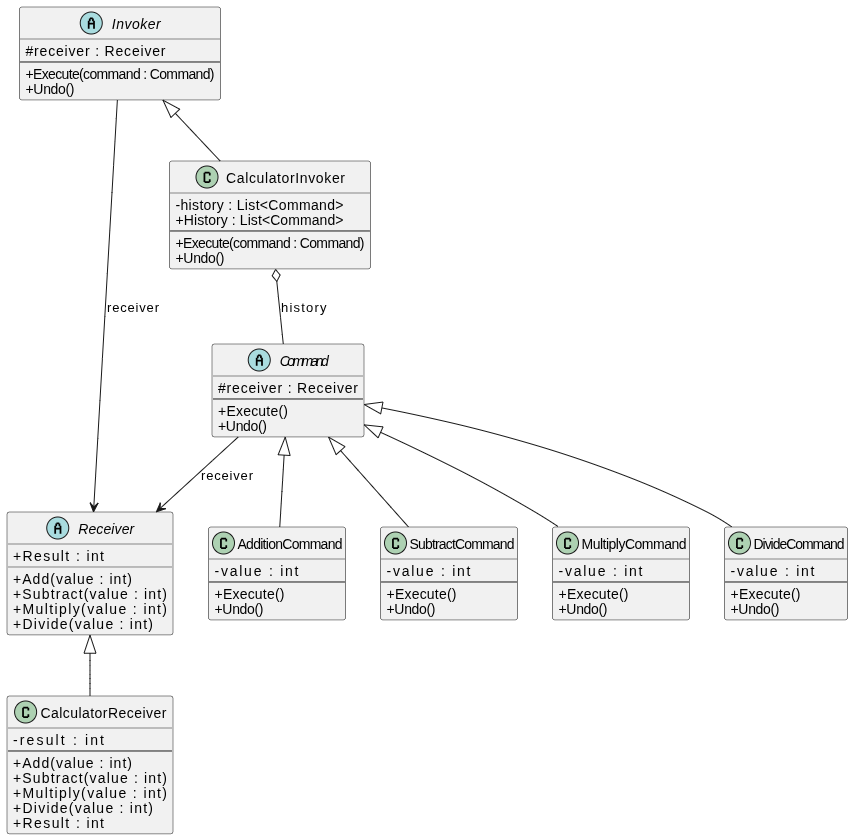

<h1 align="center">
   
  
   
  Pragma
   
</h1>

<h4 align="center">Ejemplo de implementación del patrón de diseño Command en Flutter</h4>

  
  

Este proyecto se enmarca en un artefacto asociado a la aplicación del patrón de diseño Command, enfocado en encapsular acciones del usuario como objetos que pueden ser ejecutados, desacoplados y gestionados independientemente de los invocadores. Dentro del contexto de una arquitectura limpia en Flutter, su implementación prioriza un diseño minimalista que evite la sobreingeniería y mantenga una separación limpia entre las capas de presentación, dominio y datos.  

Para demostrar su uso, este proyecto aplica del patrón de diseño Command en una calculadora Flutter, donde operaciones como adición, división, multiplicación y sustracción se encapsulan como objetos independientes, permitiendo su ejecución sin vincularlos directamente a la interfaz, facilitando escalabilidad y gestión de acciones como deshacer.

A continuación, se detalla el diagrama del proyecto, resaltando la estructura y responsabilidades de los componentes clientes (originadores de comandos), manejadores (invocadores) y comandos (objetos que encapsulan la acción y su lógica).  

  <a href="#topicos">Topicos</a> •
  <a href="#instalación-y-ejecución">Instalación y ejecución</a> •
  <a href="#consideraciones">Consideraciones</a> •
  <a href="#tecnologias">Tecnologías</a> •
  <a href="#credits">Autores</a> •
  <a href="#related">Relacionados</a>

## Topicos

* Flutter
* Dart
* Command Pattern

## Instalación y ejecución

Para clonar y ejecutar está aplicación, necesitas [Git](https://git-scm.com) y [Flutter SDK](https://docs.flutter.dev/get-started/install) instalados en tu equipo. Una vez clonado el repositorio, tu IDE te recomendará hacer `flutter pub get`, una vez obtenidas las dependencias necesarias del proyecto mendiante el anterior comando. Podemos compilar el proyecto ya sea en el navegador, emulador, simulador o dispositivo físico.

## Consideraciones

Para decidir si el patrón de diseño Command es adecuado dentro de una arquitectura limpia, es esencial evaluar varios aspectos que aseguren una solución clara, mantenible y flexible:

1. **Separación de responsabilidades y desacoplamiento**

    El patrón permite encapsular una solicitud como objeto independiente, de modo que el invocador no conoce los detalles de la acción ni quién la ejecuta, separando claramente la lógica de negocio de la interfaz que la dispara.

2. **Extensibilidad y escalabilidad**

    Al agregar nuevos commands (por ejemplo, operaciones aritméticas adicionales) solo se crea una nueva clase que implementa la interfaz del command, sin modificar el código existente, lo que favorece la evolución del sistema con bajo impacto.

3. **Alineación con principios SOLID**

   - Principio de Inversión de Dependencias (DIP): Los componentes de alto nivel (invokers) dependen de abstracciones (la interfaz del command) y no de implementaciones concretas.  
   - Principio de Abierto/Cerrado (OCP): Se pueden introducir nuevos commands sin alterar el código de los invocadores o de los commands ya existentes.
   - Principio de Responsabilidad Única (SRP): Cada command tiene una única razón de cambio: ejecutar una acción específica.

4. **Mantenibilidad y pruebas**  

    Al encapsular la acción en un objeto, es fácil inyectar dependencias simuladas (mocks) o valores de prueba, facilitando pruebas unitarias aisladas y confiables para cada command y para el flujo de invocación.

5. **Simplicidad estructural y bajo acoplamiento**

    El patrón introduce una capa ligera de objetos de commands que no impone estructuras rígidas, adaptándose tanto a aplicaciones simples (como una calculadora) como a sistemas más complejos donde se requiera deshacer/rehacer, colas de commands o registro de operaciones.

## Autores

| [ Jorge Mogotocoro](https://github.com/jmogotoc)   | 
:------------------------------------------------------------------------------------------------------------------------------------------------------------------------------:|

## Relacionados

- El patrón de diseño Command ofrece soluciones estructuradas a problemas comunes en el desarrollo de aplicaciones Flutter, especialmente relacionados con la encapsulación de acciones, la gestión de operaciones y la separación de responsabilidades. Funciona como una herramienta reutilizable y adaptable que permite organizar mejor el código, mejorar la escalabilidad y facilitar el mantenimiento. Para profundizar en su uso y beneficios, recomendamos visitar el siguiente [enlace](https://refactoring.guru/design-patterns/command).